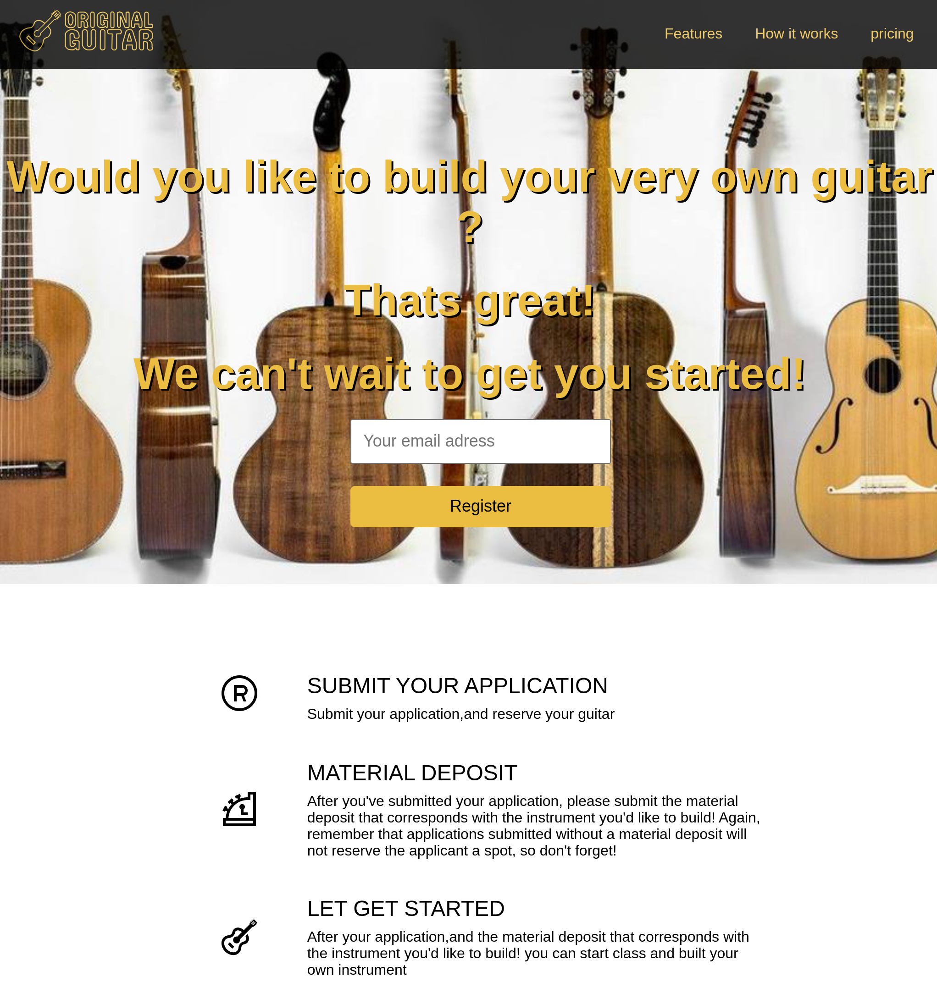

# product landing page

## In this project I learned how :
<ul>
<li>To built a product landing page </li>
<li>Choose the right color and the information to show to the custumer.</li>
<li>Explaine the steps to follow to get the product.</li>
<li>Show some information about the prodcut that we sell</li>
</ul>

You can perview project <a href="https://product-landing-page-4rta.onrender.com">here</a>

